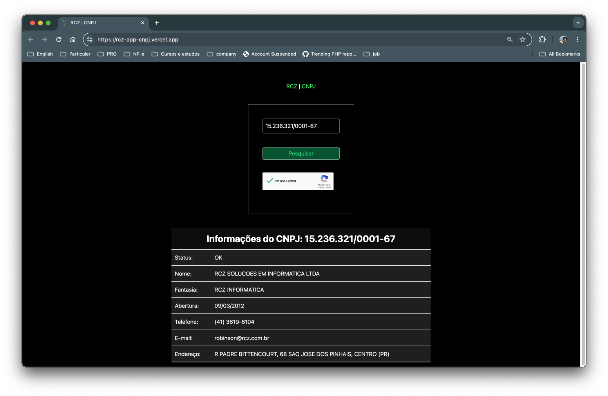
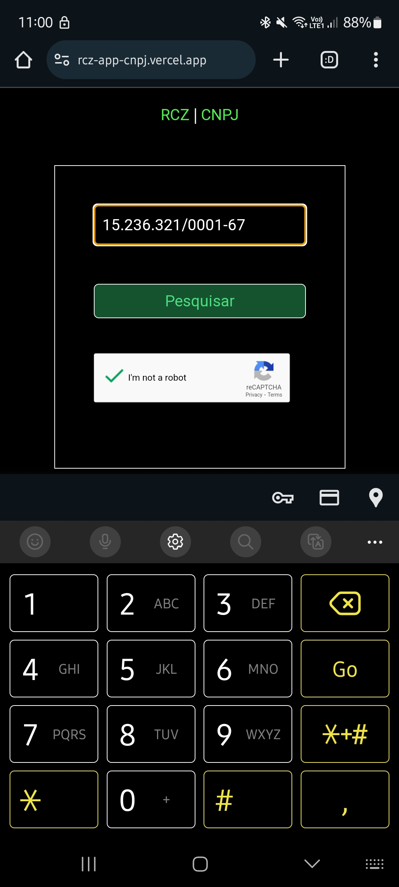

# RCZ App CNPJ

## Índice
- [RCZ App CNPJ](#rcz-app-cnpj)
  - [Índice](#índice)
  - [Versão Desktop](#versão-desktop)
  - [Versão Mobile](#versão-mobile)
  - [Descrição](#descrição)
  - [Pré-requisitos](#pré-requisitos)
  - [Instalação](#instalação)
    - [Acesse a pasta do projeto](#acesse-a-pasta-do-projeto)
  - [Configure o projeto local](#configure-o-projeto-local)
    - [BackEnd](#backend)
      - [Acesse a aplicação online](#acesse-a-aplicação-online)
    - [Configuração do FrontEnd Localmente](#configuração-do-frontend-localmente)
  - [Erros, exceções e considerações técnicas](#erros-exceções-e-considerações-técnicas)
    - [Erros](#erros)
    - [Excessão](#excessão)
    - [Consideração técnica](#consideração-técnica)

## Versão Desktop

## Versão Mobile


## Descrição

- Esta aplicação apresenta informações públicas da Receita Federal, sobre empresas a partir da pesquisa, pelo número de CNPJ.
- Adicionei o dispositivo de segurança reCaptcha, que ajuda a evitar o ataque de robos em aplicações web.

## Pré-requisitos

- Node.js (versão 14 ou superior)
- npm (versão 6 ou superior)

## Instalação

Clone o repositório:

```bash
git clone git@github.com:tiagoralves/rcz-app-cnpj.git
``` 

### Acesse a pasta do projeto
```bash
cd rcz-app-cnpj
```

## Configure o projeto local

1. Instalando as dependencias do projeto:
```bash
npm install
```

### BackEnd

2. Inicie o Servidor Backend localmente:
```bash
  npm run backend
```
#### Acesse a aplicação online
3.1. Assim que o servidor backend estiver rodando na maquina local (porta 8899), a aplicação web pode ser acessada [neste endereço](https://rcz-app-cnpj.vercel.app/).

### Configuração do FrontEnd Localmente

4. Caso queira executar o Frontend localmente, execute o código abaixo em um novo terminal (dentro da pasta do projeto rcz-app-cnpj)
```bash
  npm run frontend
```
  4.1. Acesse a aplicação localmente em: localhost:8899


## Erros, exceções e considerações técnicas

### Erros
5. Se a mensagem abaixo aparecer, o servidor backend não está funcinando, verifique a instrução 2 deste documento.
```bash
Failed to submit form. Please try again later.
```
### Excessão
6. Embora tenha sido desenvolvida com principios de responsividade, esta aplicação não funciona em dispositivos móveis, pois os navegadores mobile não identificam a segurança necessária da aplicação backend (localhost:8899).

7. Todos componentes estão organizados no mesmo arquivo (App.js) pois o servidor web (Vercel) apresentou erro na interpretação de componentes separados por arquivo.
8. Em uma aplicação real o arquivo .env não seria enviado ao repositório remoto, neste caso as credenciais foram criadas para este projeto.

### Consideração técnica

9. Principais técnicas de desenvolvimento de sistemas aplicadas:
  - Segurança: Completely Automated Public Turing test to tell Computers and Humans Apart;
  - Conventional commit;
  - DRY;
  - Clean Code.


